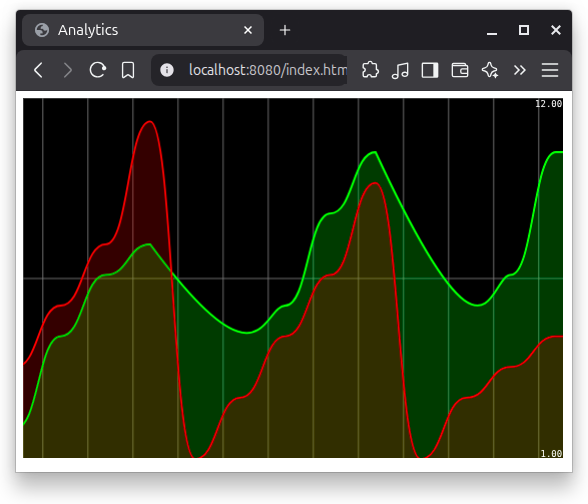

# Event-Driven Architecture with Kafka and Spring Cloud Stream

## Table of Contents

- [Overview](#overview)
- [Project Description](#project-description)
- [Architecture](#architecture)
- [Technologies Used](#technologies-used)
- [Project Structure](#project-structure)
- [Features](#features)
- [Installation & Setup](#installation--setup)
- [Configuration](#configuration)
- [Usage](#usage)
- [API Endpoints](#api-endpoints)
- [Kafka Topics](#kafka-topics)
- [Data Flow](#data-flow)
- [Real-time Analytics](#real-time-analytics)
- [Testing](#testing)
- [Demonstration](#demonstration)

---

## Overview

This project demonstrates an **event-driven architecture** using **Apache Kafka** and **Spring Cloud Stream**. It implements a real-time page event tracking and analytics system that captures user interactions, processes them through Kafka streams, and provides real-time analytics through a web-based dashboard.

The application showcases modern microservices patterns including:

- Event production and consumption
- Stream processing with windowing
- Real-time analytics
- Reactive programming with Server-Sent Events (SSE)

---

## Project Description

The **Event-Driven Kafka Spring Cloud Stream** application is designed to track and analyze page view events in real-time. It simulates a web analytics system where:

1. **Events are generated** automatically or published manually via REST endpoints
2. **Events are filtered and processed** using Kafka Streams with time-windowed aggregations
3. **Real-time analytics** are computed and streamed to a web dashboard
4. **Interactive visualizations** display page visit counts over 5-second time windows

This project serves as a comprehensive example of:

- Building event-driven systems with Spring Cloud Stream
- Implementing stream processing with Kafka Streams
- Creating real-time analytics dashboards
- Applying reactive programming patterns

---

## Architecture

### High-Level Architecture

```
┌─────────────────┐
│  Event Producer │ (Supplier Bean / REST Controller)
└────────┬────────┘
         │
         ▼
    ┌────────┐
    │ Topic  │ t2
    │  t1    │
    └────┬───┘
         │
         ▼
┌─────────────────┐
│ Event Consumer  │ (Consumer Bean)
│  (Logger)       │
└─────────────────┘

         │
         ▼
    ┌────────┐
    │ Topic  │ t2
    └────┬───┘
         │
         ▼
┌─────────────────────┐
│ Stream Processor    │ (KStream Function)
│ - Filter            │
│ - Map               │
│ - GroupBy           │
│ - Window (5s)       │
│ - Count             │
└────────┬────────────┘
         │
         ▼
    ┌────────┐
    │ Topic  │ t3
    │ State  │ count-store
    └────┬───┘
         │
         ▼
┌─────────────────────┐
│ Analytics REST API  │ (SSE Endpoint)
│  /analytics         │
└────────┬────────────┘
         │
         ▼
┌─────────────────────┐
│   Web Dashboard     │ (Real-time Chart)
│   (SmoothieChart)   │
└─────────────────────┘
```

### Component Description

- **Event Producer**: Generates `PageEvent` objects either automatically (via Supplier) or manually (via REST endpoint)
- **Event Consumer**: Logs incoming events to the console
- **Stream Processor**: Filters, aggregates, and counts events in 5-second windows
- **Analytics API**: Exposes real-time analytics via Server-Sent Events
- **Web Dashboard**: Displays live charts of page visit counts

---

## Technologies Used

### Core Technologies

- **Java 21**: Latest LTS version with modern language features
- **Spring Boot 3.5.6**: Application framework
- **Spring Cloud Stream 2025.0.0**: Event-driven microservices framework
- **Apache Kafka**: Distributed streaming platform
- **Kafka Streams**: Stream processing library

### Dependencies

- **Spring Boot Starter Web**: RESTful web services
- **Spring Boot Starter Actuator**: Application monitoring and management
- **Spring Cloud Stream Binder Kafka**: Kafka integration for Spring Cloud Stream
- **Spring Cloud Stream Binder Kafka Streams**: Kafka Streams integration
- **Spring Kafka**: Core Kafka support
- **Lombok**: Reduces boilerplate code
- **SmoothieChart.js**: Real-time charting library

### Infrastructure

- **Docker & Docker Compose**: Container orchestration
- **Confluent Kafka**: Enterprise-grade Kafka distribution
- **Zookeeper**: Kafka cluster coordination

---

## Project Structure

```
event-driven-kafka-spring-cloud-stream/
│
├── src/
│   ├── main/
│   │   ├── java/ma/enset/event_driven_kafka_spring_cloud_stream/
│   │   │   ├── EventDrivenKafkaSpringCloudStreamApplication.java  # Main application
│   │   │   ├── controllers/
│   │   │   │   └── PageEventController.java                       # REST endpoints
│   │   │   ├── events/
│   │   │   │   └── PageEvent.java                                 # Event model (Record)
│   │   │   └── handlers/
│   │   │       └── PageEventHandler.java                          # Event processing beans
│   │   └── resources/
│   │       ├── application.properties                             # Application configuration
│   │       └── static/
│   │           └── index.html                                     # Analytics dashboard
│   └── test/
│       └── java/ma/enset/event_driven_kafka_spring_cloud_stream/
│           └── EventDrivenKafkaSpringCloudStreamApplicationTests.java
│
├── docker-compose.yml                                             # Kafka infrastructure
├── pom.xml                                                        # Maven dependencies

```

---

## Features

### 1. **Automatic Event Generation**

- Continuous generation of random `PageEvent` objects
- Configurable polling interval (200ms)
- Random page names (P1, P2) and users (U1, U2)

### 2. **Manual Event Publishing**

- REST API for publishing custom events
- Flexible topic routing
- Dynamic event creation

### 3. **Event Consumption & Logging**

- Real-time event logging to console
- Monitoring of all incoming events
- Debugging and auditing capabilities

### 4. **Stream Processing**

- **Filtering**: Events with duration > 100ms
- **Grouping**: By page name
- **Windowing**: 5-second tumbling windows
- **Aggregation**: Count of events per page
- **State Store**: Materialized view for querying

### 5. **Real-time Analytics**

- Server-Sent Events (SSE) endpoint
- Live data streaming every second
- Time-windowed analytics (5-second windows)
- Interactive query of state stores

### 6. **Web Dashboard**

- Real-time visualization with SmoothieChart.js
- Separate lines for each page (P1, P2)
- Auto-updating charts
- Smooth animations and tooltips

---

## Installation & Setup

### 1. Clone the Repository

```bash
git clone https://github.com/4bdex/Event-Driven-kafka-Spring-Cloud-Stream.git
cd event-driven-kafka-spring-cloud-stream
```

### 2. Start Kafka Infrastructure

The project includes a `docker-compose.yml` file that sets up Zookeeper and Kafka:

```bash
docker-compose up -d
```

This will start:

- **Zookeeper** on port 2181
- **Kafka Broker** on port 9092

Verify the containers are running:

```bash
docker ps
```

### 3. Build the Application

```bash
mvn clean install
```

### 4. Run the Application

```bash
mvn spring-boot:run
```

Or run directly from your IDE by executing the main class:
`EventDrivenKafkaSpringCloudStreamApplication`

### 5. Open the Dashboard

Navigate to `http://localhost:8080` in your browser

---

## Configuration

### Configuration Breakdown

| Property                                 | Description                      |
| ---------------------------------------- | -------------------------------- |
| `pageEventConsumer-in-0.destination=t1`  | Consumer reads from topic `t1`   |
| `pageEventSupplier-out-0.destination=t2` | Supplier writes to topic `t2`    |
| `kStreamFunction-in-0.destination=t2`    | Stream processor reads from `t2` |
| `kStreamFunction-out-0.destination=t3`   | Stream processor writes to `t3`  |
| `producer.poller.fixed-delay=200`        | Produce event every 200ms        |
| `commit.interval.ms=1000`                | Kafka Streams commit interval    |

---

## Usage

### Monitoring Events

Watch the console output to see events being logged:

```
************
PageEvent[name=P1, user=U2, date=Sat Oct 18 2025 14:30:45, duration=5234]
************
************
PageEvent[name=P2, user=U1, date=Sat Oct 18 2025 14:30:45, duration=7891]
************
```

### Viewing Analytics

The web dashboard at `http://localhost:8080` displays:

- Real-time line charts for P1 and P2 page visits
- Color-coded visualization (Green for P1, Red for P2)
- Counts aggregated over 5-second windows
- Auto-refreshing every 500ms

---

## API Endpoints

### 1. Publish Event

**Endpoint**: `GET /publish`

**Parameters**:

- `name` (String): Page name
- `topic` (String): Kafka topic to publish to

**Example**:

```bash
curl "http://localhost:8080/publish?name=HomePage&topic=t1"
```

**Response**:

```json
{
  "name": "HomePage",
  "user": "U1",
  "date": "2025-10-18T14:30:45.123+00:00",
  "duration": 5234
}
```

### 2. Real-time Analytics Stream

**Endpoint**: `GET /analytics`

**Content-Type**: `text/event-stream`

**Response**: Server-Sent Events stream

**Example**:

```bash
curl http://localhost:8080/analytics
```

**Sample Output**:

```
data:{"P1":42,"P2":38}

data:{"P1":45,"P2":39}

data:{"P1":43,"P2":41}
```

Each event contains the count of page visits in the current 5-second window.

---

## Kafka Topics

### Topic Flow

```
t1 ← Manual events via /publish endpoint
t2 ← Auto-generated events (Supplier) + Events from t1
t3 ← Processed aggregations (output of KStream)
```

### Topic Descriptions

| Topic  | Producer            | Consumer          | Purpose                 |
| ------ | ------------------- | ----------------- | ----------------------- |
| **t1** | PageEventController | pageEventConsumer | Manual event publishing |
| **t2** | pageEventSupplier   | kStreamFunction   | Auto-generated events   |
| **t3** | kStreamFunction     | -                 | Aggregated results      |

### State Store

- **Name**: `count-store`
- **Type**: WindowStore
- **Window Size**: 5 seconds
- **Purpose**: Stores aggregated counts for interactive queries

---

## Data Flow

### Detailed Event Processing Flow

1. **Event Generation**

   ```
   pageEventSupplier generates events every 200ms
   → PageEvent(name, user, date, duration)
   → Published to topic t2
   ```

2. **Event Consumption**

   ```
   pageEventConsumer reads from t1
   → Logs event to console
   → Used for monitoring/debugging
   ```

3. **Stream Processing**

   ```
   kStreamFunction reads from t2
   → Filter: duration > 100ms
   → Map: Extract page name as key
   → GroupBy: Page name
   → WindowedBy: 5-second tumbling windows
   → Count: Aggregate events per window
   → Store: Materialize to "count-store"
   → Output to t3
   ```

4. **Analytics Query**

   ```
   /analytics endpoint
   → Query "count-store" every 1 second
   → Fetch all windows (last 5 seconds)
   → Build Map<PageName, Count>
   → Stream via SSE to clients
   ```

5. **Visualization**
   ```
   Web Dashboard
   → Subscribe to /analytics SSE endpoint
   → Parse JSON data
   → Update SmoothieChart every 500ms
   → Display real-time graphs
   ```

---

## Real-time Analytics

### Window-Based Aggregation

The application uses **tumbling windows** of 5 seconds:

```java
.windowedBy(TimeWindows.ofSizeWithNoGrace(Duration.ofSeconds(5)))
```

- **Window Type**: Tumbling (non-overlapping)
- **Window Size**: 5 seconds
- **Grace Period**: None (no late events accepted)

### Interactive Queries

The `InteractiveQueryService` allows querying the materialized state store:

```java
ReadOnlyWindowStore<String, Long> windowStore =
    interactiveQueryService.getQueryableStore(
        "count-store",
        QueryableStoreTypes.windowStore()
    );
```

This enables:

- Real-time access to aggregated data
- No need to consume from output topics
- Low-latency analytics queries

### Analytics Algorithm

1. Query the window store every second
2. Fetch all windows from (now - 5s) to now
3. Iterate through windowed results
4. Extract page name and count
5. Build a map of current counts
6. Stream to connected clients via SSE

---

## Testing

### Manual Testing

1. **Verify Event Production**

   ```bash
   # Check console logs for auto-generated events
   # You should see events printed every 200ms
   ```

2. **Test Manual Publishing**

   ```bash
   curl "http://localhost:8080/publish?name=TestPage&topic=t1"
   ```

3. **Test Analytics Endpoint**

   ```bash
   curl http://localhost:8080/analytics
   # Should stream real-time counts
   ```

4. **Test Web Dashboard**
   - Open `http://localhost:8080`
   - Verify charts are updating
   - Check P1 and P2 lines are visible

### Kafka Monitoring

**List Topics**:

```bash
docker exec -it broker kafka-topics --bootstrap-server localhost:9092 --list
```

**Consume from Topic**:

```bash
docker exec -it broker kafka-console-consumer \
    --bootstrap-server localhost:9092 \
    --topic t2 \
    --from-beginning
```

**Check Consumer Groups**:

```bash
docker exec -it broker kafka-consumer-groups \
    --bootstrap-server localhost:9092 \
    --list
```

## Demonstration



_Figure: Real-time analytics dashboard showing page visit counts over 5-second windows._
